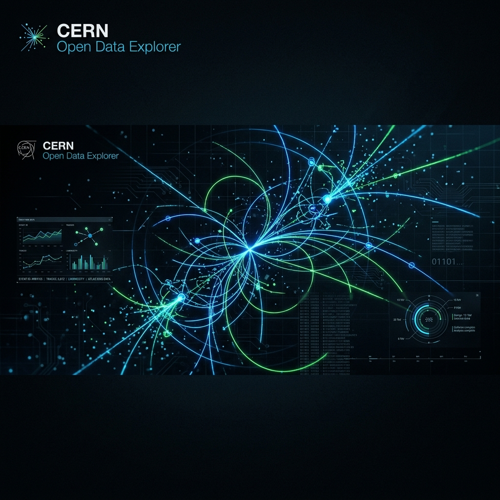

# ⚛️ CERN Open Data Explorer



[](https://share.streamlit.io/)
[](https://www.python.org/downloads/release/python-3110/)
[](https://opensource.org/licenses/MIT)
[](https://opendata.cern.ch/)

**CERN Open Data Explorer** is a professional-grade interactive dashboard designed for the exploration and analysis of authentic particle physics datasets from the LHC (Large Hadron Collider). It bridges the gap between raw scientific data and intuitive visualization, enabling researchers and students to "rediscover" fundamental particles like the $J/\psi$, $\Upsilon$, and $Z$ bosons.

---

## 🚀 Key Features

*   **⚡ High-Performance Analysis**: Leveraging [Polars](https://pola.rs/) for lightning-fast columnar processing of millions of collision events.
*   **🌐 Real-time CERN Portal Integration**: Search and stream datasets directly from the `opendata.cern.ch` API with integrated metadata peeking.
*   **📊 Publication-Quality Graphics**: Integrated Matplotlib engine for generating high-DPI (300) histograms suitable for scientific publication.
*   **🧊 3D Event Visualization**: Native browser-based 3D momentum vector displays and event-by-event animations using Plotly.
*   **🕵️ Deep ROOT/DST Inspection**: Advanced diagnostic tools to peer into the nested structure of complex High Energy Physics (HEP) objects via [Uproot](https://uproot.readthedocs.io/).
*   **📝 LHCb Macro Generator**: Automated generation of DaVinci/Gaudi configuration code for CERN GRID processing.
*   **✅ Modular Architecture**: Decoupled physics logic, plotting engines, and UI utilities for maximum maintainability and testability.

---

## 🛠️ Technology Stack

| Component | Technology |
| **Frontend/Dashboard** | [Streamlit](https://streamlit.io/) |
| **Data Processing** | [Polars](https://pola.rs/), [NumPy](https://numpy.org/), [Awkward Array](https://awkward-array.org/) |
| **HEP Integration** | [Uproot 5](https://uproot.readthedocs.io/), XRootD |
| **Visualization** | [Plotly](https://plotly.com/), [Matplotlib](https://matplotlib.org/) |
| **Validation & Testing** | [Pytest](https://pytest.org/), [Pydantic](https://docs.pydantic.dev/) |
| **Package Management** | [Pixi](https://pixi.sh/) |

---

## 🏁 Getting Started

### Prerequisites

*   [Pixi](https://pixi.sh/) (Conda-compatible package manager)
*   Python 3.11+

### Installation

Clone the repository and install dependencies using Pixi:

```bash
pixi install
```

### Running the Application

Launch the Streamlit dashboard:

```bash
pixi run streamlit run main.py
```

---

## 🧪 Testing & Quality Assurance

This project maintains high scientific reliability through a robust automated testing suite.

### Running Tests
Execute the full test suite using Pixi:

```bash
pixi run pytest
```

The suite covers:
*   **Unit Tests**: Validation of kinematic filters, column mapping, and CERN API interactions.
*   **Data Validation**: Schema enforcement and data loading stability using Pydantic.
*   **E2E Tests**: Full pipeline verification from data acquisition to physics visualization.

### 📊 Test Coverage

The project maintains high code quality through a comprehensive test suite of **102 tests**:

| Component | Test Focus | Coverage |
| :--- | :--- | :--- |
| **Physics Analysis** | Kinematic filters, Dimuon resonance matching | High |
| **CERN API Bridge** | Record searching, Pagination, Error handling | High |
| **Data Engine** | Schema enforcement, Polars/Pandas loading | Medium-High |
| **Visualization** | Histogram generation, 3D vector calculation | Medium |
| **Integration** | End-to-end pipeline (Mocked & Real API) | High |

> [!NOTE]
> All 83/83 local unit tests pass in ~6 seconds. Integration tests requiring network access may take longer depending on CERN server availability.

---

## 📂 Project Structure

```text
.
├── assets/             # Brand assets and images
├── data/               # Local cache for CERN datasets
├── lib/                # Core physics library (modular package)
│   ├── analysis/       # Physics calculations & plotting logic
│   ├── exploration/    # CERN API bridge & ROOT utilities
│   └── ui_utils.py     # Enterprise branding & UI components
├── pages/              # Streamlit dashboard modules
├── tests/              # Comprehensive automated test suite
├── main.py             # Application entry point
├── pixi.toml           # Environment & dependency management
└── pytest.ini          # Testing configuration
```

---

## ⚠️ Use Cases & Known Limitations

While robust, users should be aware of the following technical constraints:

*   **🌐 Network Latency**: Real-time streaming from `opendata.cern.ch` is subject to CERN's server status. If a dataset is unresponsive, try **📥 Fetching** the file for local processing.
*   **🧊 ROOT Header Fragmentation**: High-complexity ROOT files with deeply nested structures may fail the initial "Peek" due to HTTP byte-range fragmentation. In these cases, use **🌊 Stream** or **📥 Fetch**.
*   **🧠 Memory Management**: Processing CSVs with over 10M events may exceed browser/server memory limits in Streamlit. Use the "Sampling" or "Filter" features to reduce data volume before visualization.
*   **🎯 Identification Heuristics**: Particle identification relies on rigid PDG mass tolerances. Overlapping peaks (e.g., $J/\psi$ and $\psi(2S)$ in low-res datasets) may require manual histogram binning adjustments.
*   **⚛️ XRootD Availability**: High-speed XRootD streaming requires specific network ports to be open. If XRootD fails, fallback to standard HTTP streaming is automatic.

---

## 🧪 Scientific Validation

The analysis logic follows standard HEP workflows for Dimuon resonance reconstruction. Invariant mass calculation ($M$) is performed using the relativistic 4-momentum formula:

$$M = \sqrt{(E_1+E_2)^2 - \|\vec{p}_1 + \vec{p}_2\|^2}$$

Validation against PDG (Particle Data Group) values is integrated into the automated testing pipeline and the "Publication Export" module.

## 👨‍🔬 Author

**Vytas Mulevicius**  
*Lead Developer & Physics Enthusiast*  
[GitHub Profile](https://github.com/VytasMule) | [LinkedIn](https://www.linkedin.com/in/vytasmule/)

---

## 🤝 Contributing

We welcome contributions from the particle physics and software engineering communities! Please see our `CONTRIBUTING.md` (coming soon) for details on our code of conduct and the process for submitting pull requests.

## 📄 License

This project is licensed under the MIT License - see the [LICENSE](LICENSE) file for details.

## 🙏 Acknowledgments

*   **CERN Open Data Group** for providing authentic LHC collision data.
*   **Scikit-HEP** developers for tools like Uproot and Awkward Array.
*   Academic institutions for supporting Open Science.

---

<p align="center">
  <i>Empowering the next generation of particle physicists.</i><br>
  <b>Open Science | Open Data | Open Progress</b>
</p>